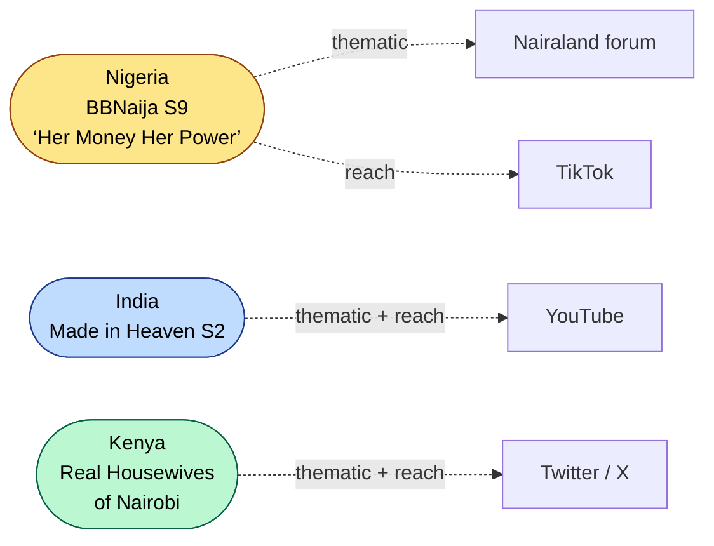
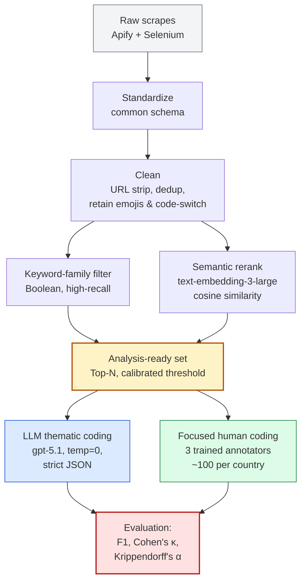
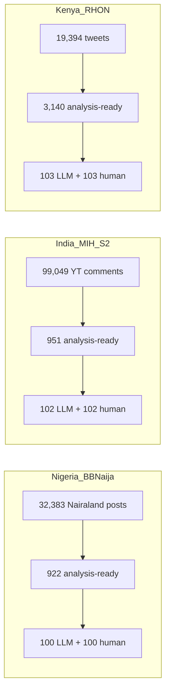
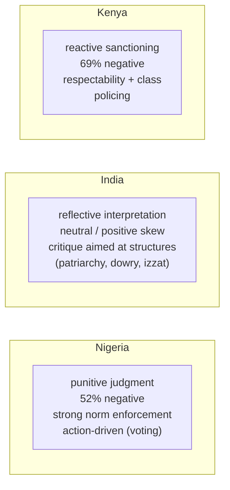
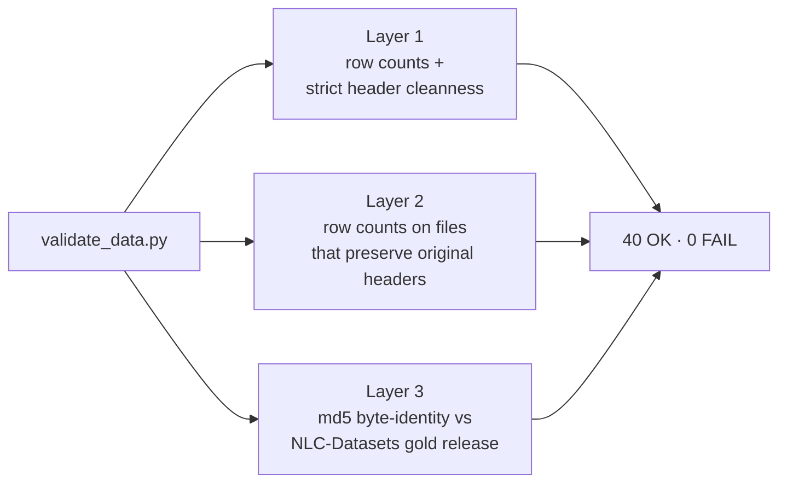

# WB MIP Social Listening — Gender Norms Across Three Reality TV Audiences

How do online audiences talk about gender norms when they discuss popular
TV? This repo holds the data pipeline, code, and coded outputs for a World
Bank pilot study answering that question across three countries, three
shows, three platforms.

The full write-up:
[`WB_MIP Social Listening Report Draft - WB_Penn Feedback.docx`](WB_MIP%20Social%20Listening%20Report%20Draft%20-%20WB_Penn%20Feedback.docx).

---

## What is studied



Each country picks one show whose narrative explicitly engages with women's
agency, marriage, sexuality, or status — and one platform where audience
discussion is sustained enough to study at scale.

---

## The pipeline (5 stages)



The keyword and semantic stages run in parallel; their union is sampled to
produce the analysis-ready set. The LLM and human tracks code the same
universe of comments — agreement between them is the validation gate.

---

## What's in each country's folder



Detailed mapping of every file to its stage in
[`data/PIPELINE_STAGES.md`](data/PIPELINE_STAGES.md).

---

## Repo layout

```
WB-Project/
├── README.md                       # this file
├── WB_MIP ... Report Draft.docx    # the study write-up
├── codebook/
│   ├── keywords.docx               # multilingual keyword bank (Appendix A)
│   └── codebook_spec.md            # theme taxonomies (Appendix B + F)
├── data/
│   ├── GOLD_MANIFEST.md            # which files mirror NLC-Datasets gold release
│   ├── PIPELINE_STAGES.md          # what each file is and where it sits
│   ├── raw/{india,kenya,nigeria}/
│   ├── interim/{india,kenya,nigeria}/
│   ├── processed/{india,kenya,nigeria}/
│   ├── human_coded/{india,kenya,nigeria}/
│   └── reach/{india,kenya,nigeria}/
├── notebooks/
│   ├── 01_india_mih_pipeline.ipynb
│   ├── 02_kenya_rhon_pipeline.ipynb
│   └── test/test_mih_s2.ipynb
├── src/
│   ├── app.py                      # Streamlit dashboard (3 country tabs)
│   └── wbproj/
│       ├── paths.py                # canonical paths + GOLD_MIRROR
│       ├── clean.py                # column normalizer, theme exploder
│       └── loaders.py              # typed dataset loaders
└── scripts/
    └── validate_data.py            # 3-layer integrity check
```

---

## Findings, very briefly



Same gender themes surface everywhere; **what differs is the mechanism of
enforcement**. Nigeria sanctions individual contestants; India contests
the institutions; Kenya polices respectability through class-coded talk.

The strongest negative-sentiment "rejection zones" by country:

| Country | Themes that draw the most contempt / anger |
|---------|--------------------------------------------|
| Nigeria | Conflict & humiliation (95% neg.); sexist/derogatory language (93%); sexuality / respectability policing (75%) |
| India | Body & beauty standards; gender-based violence — but negativity directed at the *norms*, not at the women |
| Kenya | Conflict & social sanctioning (87%); sexist language (94%); sexuality / body politics (74%) |

---

## LLM ↔ human agreement

| Country | Accuracy | Precision | Recall | F1 | Cohen's κ |
|---------|---:|---:|---:|---:|:---:|
| Nigeria (BBNaija) | 0.844 | 0.642 | 0.719 | **0.678** | **0.576** *(moderate)* |
| India (MIH S2) | 0.760 | 0.571 | 0.353 | 0.436 | 0.298 *(fair)* |
| Kenya (RHON) | 0.646 | 0.105 | 0.852 | 0.187 | 0.292 *(fair)* |

Kenya's low precision reflects the model over-attributing gender themes in
conflict-heavy talk. India's lower recall reflects under-detection of
*structurally framed* critique that lacks explicit gender keywords. Both
patterns are documented in Appendix I of the report.

---

## Run it

```bash
pip install -r requirements.txt
cp .env.example .env                # add OPENAI_API_KEY if running coding cells
python scripts/validate_data.py     # 40-assertion integrity check
streamlit run src/app.py            # dashboards: India · Nigeria · Kenya
```

The Streamlit app reads everything via `pathlib`, so it runs from any
working directory.

---

## Validator

`scripts/validate_data.py` runs three independent layers:



If any byte changes in a gold-mirrored file, Layer 3 catches it. If the
upstream gold tree is moved or absent, Layer 3 reports `SKIP` rather than
failing — so the validator is portable.

---

## Notes & caveats

- The repo extends the published **NLC-Datasets** pilot. 16 files in `data/`
  are byte-identical mirrors of the gold release —
  [`data/GOLD_MANIFEST.md`](data/GOLD_MANIFEST.md) lists them and
  Layer 3 of the validator pins them by md5.
- Files in `data/human_coded/` preserve their original Q-bank phrasing in
  column headers (whitespace, embedded newlines). Loaders normalize these
  in memory at load time — the source files stay byte-identical to gold.
- The BBNaija TikTok reach dataset described in Section 2.1 of the report
  (~60K comments / 372 videos) is not currently in the repo. Drop a file at
  `data/raw/nigeria/BBNaija_tiktok.xlsx` to enable the BBNaija TikTok tab.
- The notebooks reference older model identifiers (`gpt-4o-mini`); the
  report's documented production model is `gpt-5.1` at temperature `0`.
- Discourse data are from self-selected, platform-specific, digitally active
  audiences — descriptive of those publics, not representative of national
  populations.
